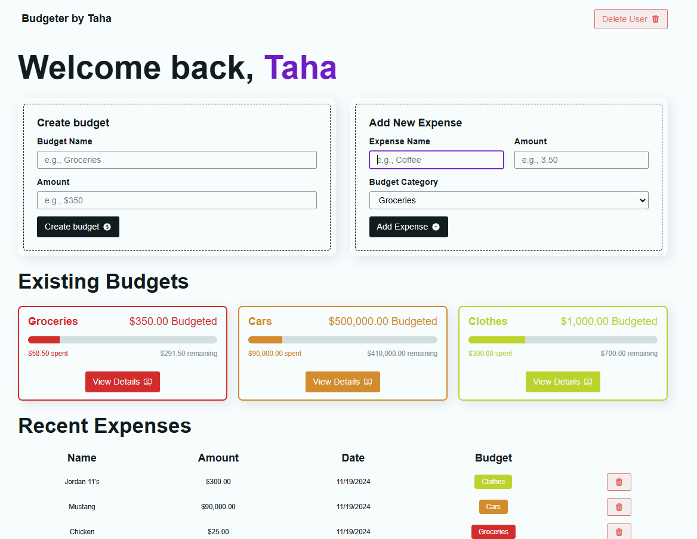

## Brokie Budgeter: Click on the image to view the demo (or just visit the site link)

[Page Link](https://sprightly-squirrel-ce575f.netlify.app/?index)

## Overview

This simple app is a dynamic frontend budgeting application designed to help users manage their finances directly from their browser. The application is built using React, React Router. Browser local storage ise used to store data. There is no backend server

## Key Features

- **Local Storage Integration**: Utilizes the browser's local storage to save user data persistently.
- **Dynamic Routing**: Uses React Router to handle routing, ensuring that the application's functionality corresponds to the current URL.
- **Responsive Design**: Adapts to various screen sizes, providing an optimal user experience on both desktop and mobile devices.

## Technologies

- **React**: A JavaScript library for building user interfaces.
- **React Router**: Manages the routing of the application, allowing for bookmarkable URLs and browser history navigation.
- **JavaScript**: Used for general application logic and manipulation of local storage.

